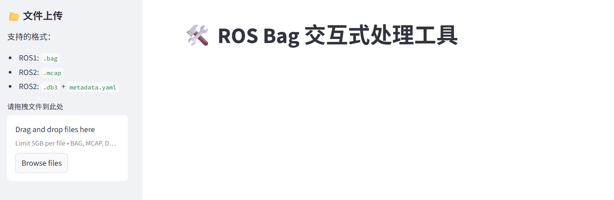
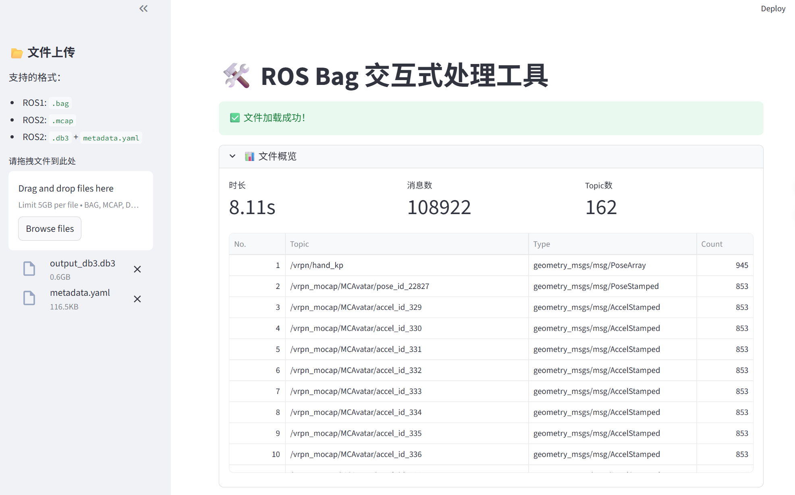
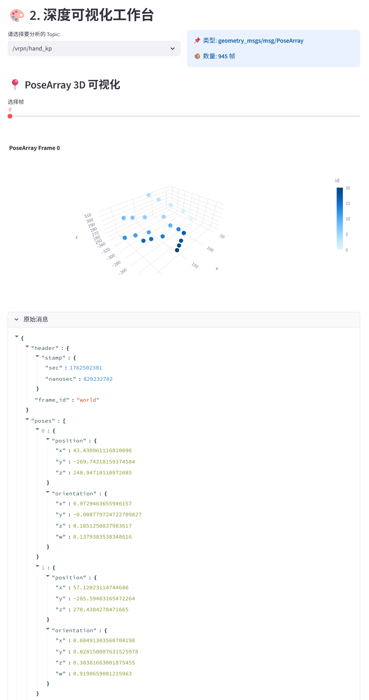
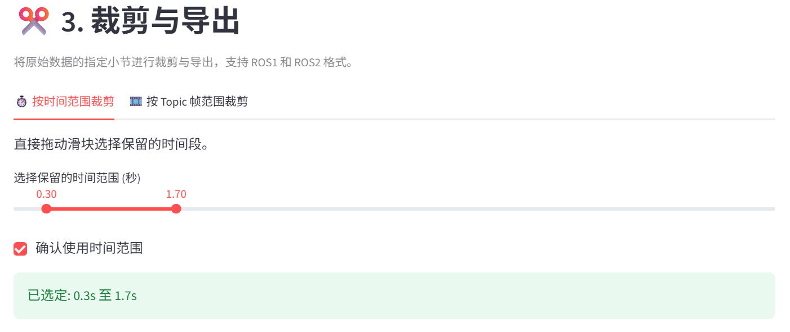

# 🛠️ Rosbag Studio: Interactive Web-based ROS Bag Analyzer & Cleaner

<p align="center">
  
  
  
  
</p>

<p align="center">
  <b>一个无需依赖 ROS 环境的轻量级、跨平台 ROS Bag 交互式分析与裁剪 Web 工具。</b><br>
  专为机器人开发者、具身智能（Embodied AI）研究人员设计，告别繁琐的命令行，在浏览器中像剪辑视频一样处理你的机器人数据。
</p>

---
## ✨ 核心痛点与特性 (Why Rosbag Studio?)

在平时的具身智能遥操作与机器人调试中，我们经常遇到以下痛点：
- **痛点 1**：机器上没装 ROS（或者版本不对），想看个数据包还得配半天环境。
- **痛点 2**：Foxglove 等工具过于庞大，而官方自带的 `rosbag filter` 命令行又极其难用。
- **痛点 3**：做模仿学习（Imitation Learning）采集数据时，往往只有中间一段数据是有效的，首尾的无效数据极难精准裁剪。
- **痛点 4**：跨版本兼容性差（ROS1 与 ROS2 格式转换头疼）。

**Rosbag Studio 完美解决了这些问题：**

- 🚫 **无需安装 ROS (Zero ROS Dependency)**：基于纯 Python 实现，Windows / Mac / Linux 均可直接运行。
- 📦 **全格式兼容 (Multi-Format Support)**：原生支持读取和导出 **ROS1 (`.bag`)**, **ROS2 SQLite3 (`.db3`)**, 以及最新的 **ROS2 MCAP (`.mcap`)**。
- 📊 **强大的多模态可视化 (Rich Visualization)**：
  - 🖼️ **图像 (Image)**：支持预览 `Image` 和 `CompressedImage`。
  - ☁️ **点云 (PointCloud2)**：内置 3D 交互式散点图，支持自动降采样防卡顿。
  - 📍 **位姿 (PoseArray)**：一键 3D 可视化多关键点位姿（非常适合灵巧手/机械臂遥操作抓取任务）。
  - 📈 **数值趋势 (Time-series)**：自动展平各类消息，绘制交互式数据曲线。
- ✂️ **精准的交互式裁剪 (Interactive Cropping)**：提供“按时间戳”和“按特定 Topic 帧数”两种裁剪模式，彻底告别盲猜时间戳。

## 🚀 快速开始 (Quick Start)

### 1. 环境准备

建议使用 Conda 创建独立的虚拟环境：
```bash
conda create -n rosbag_studio python=3.10 -y
conda activate rosbag_studio
```

### 2. 安装依赖

本项目基于强大的数据科学 Web 框架 [Streamlit](https://streamlit.io/) 和解析库[rosbags](https://pypi.org/project/rosbags/)。

```bash
pip install streamlit pandas numpy plotly Pillow
pip install rosbags lz4 zstandard
```

### 3. 一键运行

```bash
git clone https://github.com/[你的GitHub用户名]/Rosbag-Studio.git
cd Rosbag-Studio
streamlit run app.py
```

运行后，浏览器将自动打开 <http://localhost:8502>。  


## 📖 使用指南 (Usage)
### 加载数据：  
拖拽上传或浏览选择本地的rosbag文件（支持.bag / .mcap / .db3 + .yaml格式）。  
注意：如果想分析.db3格式的文件，需要把相应的.yaml文件也一并上传。
### 数据概览：
自动解析文件时长、消息总数，并列出按消息量排序的 Topic 表格。
  
### 深度可视化：  
在下拉菜单中选择感兴趣的 Topic。  
拖动下方滑块可分别查看指定帧的可视化以及原始 JSON 结构。  

对于图像、点云和曲线图，支持缩放、旋转等高自由度交互。  
### 裁剪与导出：  
- 模式一：按时间范围裁剪  
选择“按时间范围裁剪”选项。滑动底部的双向滑块，选择你需要保留的“黄金时间段”：  
   
注意：选择完成之后一定要勾选“确认使用时间范围”。 
- 模式二：按Topic帧范围裁剪
选择“按Topic帧范围裁剪”选项。先选择一个参考的Topic，然后滑动底部的双向滑块，选择你需要保留的该Topic的帧数范围。并点击“计算对应时间戳”，勾选“确认使用帧范围”。  


最后，选择你期望导出的格式，点击“开始导出”，等待处理完成后直接下载裁剪后的干净数据包。


## 🛠️ 技术栈 (Tech Stack)
Frontend & Backend: Streamlit
ROS Data Parsing: rosbags (Pure Python ROS bag reader/writer)
Data Visualization: Plotly, Pandas

## 🤝 贡献与反馈 (Contributing)
欢迎提交 Issue 和 Pull Request！如果你在具身智能或机器人领域有更特殊的数据处理需求（比如加入针对特定机械臂的关节角度可视化支持），非常欢迎一起交流完善!  
Fork 本仓库：  
1. 创建特性分支 (`git checkout -b feature/AmazingFeature`)  
2. 提交修改 (`git commit -m 'Add some AmazingFeature'`)  
3. 推送到分支 (`git push origin feature/AmazingFeature`)  
4. 发起 Pull Request

## 📄 许可证 (License)
Distributed under the MIT License. See LICENSE for more information.

## ✍️ 作者 (Author)
### Phoebe  
🤖 PhD Student researching Embodied AI & Dexterous Teleoperation  
📧 Email: [[yinbh25@mails.tsinghua.edu.cn]]
如果这个小工具对你有所帮助，欢迎给一个 ⭐️ Star！ 这对我非常重要，谢谢！